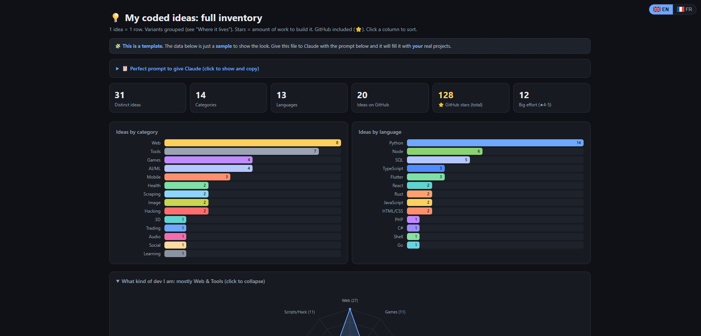
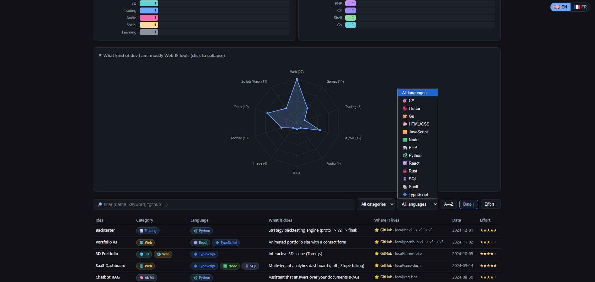

<div align="center">



# 🗂️ CodeShelf

**Every project you ever coded, on one shelf: an inventory dashboard that shows how much you built, what kind of developer you are, and how hard you worked.**  
One HTML file. Vanilla JavaScript. Filled for you by Claude, which digs through your hard drive and your GitHub.

[](index.html)
[](https://developer.mozilla.org/en-US/docs/Web/JavaScript)
[](https://claude.ai)
[](#bilingual-interface)
[](#how-it-works)
[](LICENSE)

</div>

---

## What is this?

Most developers have no idea how much they have actually built. Projects are scattered across `Desktop`, `Downloads`, old backup drives, a `dev` folder, a `dev2` folder, a school folder, and a GitHub account with half of them. Versions pile up (`app`, `app-v2`, `app-final`, `app-final-REAL`), tiny scripts get forgotten, and after a few years you can no longer answer a simple question:

> **What have I really coded, and what does it say about me as a developer?**

CodeShelf answers it. It is a single dashboard that lists **every idea you ever turned into code**, from a 10-line script to a year-long product, and turns that list into a picture of your work:

- **how many distinct ideas** you built, and how many are published on GitHub,
- **which domains** you keep coming back to (web, games, AI, trading, audio, tools…),
- **which languages** you really use, not the ones on your CV,
- **how much effort** each project took, with a 1 to 5 star scale,
- **what kind of developer you are**, with a radar weighted by effort.

You do not fill it by hand. You give the file to **Claude**, tell it where your projects live, and it explores your disk, opens the files it needs to understand each project, merges the versions, and writes the table for you.

---

## The Philosophy

### 1. A well-organized computer is a complete portfolio

CodeShelf is only as good as what Claude can find. **If your computer is well organized, Claude will find the entirety of your work** and the dashboard becomes a full history of everything you have coded. If your projects are scattered, the scan is the perfect excuse to tidy them up: point Claude to the right folders, and nothing gets lost.

### 2. One idea = one row

What matters is the **idea**, not the folder. `snake.py`, `snake_v2`, and `snake-final` are one project that evolved, so they become **one row**. The evolution is kept in the "Where it lives" column with arrows:

```
local/rogue v1 -> v2 -> final
```

This gives an honest count. Ten copies of the same app do not make you ten times more productive.

### 3. Include everything

The quick script you wrote to rename 300 files counts. The abandoned prototype counts. The school exercise counts. **Small projects are part of your journey**, and they show where your curiosity went. The star scale is there to keep things in proportion.

### 4. Stars measure work, not quality

The stars do **not** judge whether a project is good. They estimate **how much work it took to build**. A messy 6-month project is a 5, a perfect 20-line script is a 1. This is what makes the radar meaningful: it shows where you **invested your time**, not where you got lucky.

### 5. A global view of your level and your involvement

Put together, the table, the charts, and the radar give you a **global view of your development level and your commitment**: what you master, what you only touched, what you keep returning to, and how your projects grew over the years. It is useful for yourself, for a portfolio, for a job interview, or simply to realize how far you have come.

---

## Quick Start

### Option A: Claude Code (recommended, Claude can read your disk)

```bash
git clone https://github.com/<username>/codeshelf.git
cd codeshelf
claude
```

Then paste the prompt below. Claude scans your folders, fills `index.html`, and opens it in your browser.

### Option B: claude.ai

1. Open `index.html` and copy its content.
2. Paste it into a Claude conversation with the prompt below, plus a list of your projects (or a `tree` / `dir /s` output of your folders).
3. Save the result as `index.html` and open it.

Option A gives far better results: Claude can open the files itself and understand what each project really does.

### The prompt

The same prompt is built into the dashboard (**Perfect prompt to give Claude**, with a copy button):

```
You are my assistant to fill this HTML dashboard (index.html) that inventories my coding projects.
First read the big "INSTRUCTIONS FOR CLAUDE" comment at the top of the file, then follow it.

My project folders: (e.g. ~/dev, ~/Desktop/code, D:\projects)
My GitHub username: (e.g. my_handle, leave empty if none)

Steps:
1. Scan my folders: find real projects (package.json, index.html, main.py, manage.py,
   pubspec.yaml, composer.json, go.mod, Cargo.toml). Read a file when a name is ambiguous.
2. Fetch my GitHub repos (https://api.github.com/users/MY_HANDLE/repos?per_page=100) and sum the stars.
3. Replace ONLY the "const P = [...]" array, the GHSTARS variable, and the date in the subtitle.
   Do not change anything else.
...
```

### Your inventory in 5 steps

| Step | Action                                                                                  | Who        |
| ---- | --------------------------------------------------------------------------------------- | ---------- |
| 1    | List the folders where your projects live (every drive, every backup)                   | you        |
| 2    | Give Claude the prompt, the folders and your GitHub username                            | you        |
| 3    | Claude scans, opens ambiguous files, merges versions, rates effort, fetches GitHub      | Claude     |
| 4    | Claude rewrites the data table and opens the dashboard                                  | Claude     |
| 5    | Review: fix a description, merge two rows, adjust a star. Ask Claude or edit by hand    | you        |

> Tip: tell Claude what a project **means** to you when its folder name is cryptic (`proj_final2`, `test3`…). The more context it has, the better the descriptions and the merges.

---

## The Effort Scale (⭐ 1 to 5)

The 6th field of each row is the **amount of work needed to build the project**. Here is the scale Claude uses, and the one to use when you correct it:

| Stars        | Level         | Typical size                     | Examples                                                         |
| ------------ | ------------- | -------------------------------- | ---------------------------------------------------------------- |
| ★☆☆☆☆        | Script        | a few lines to an afternoon      | a file renamer, a terminal Snake, an exercise                    |
| ★★☆☆☆        | Small tool    | a weekend, one main feature      | a URL shortener, a price watcher, a pixel art editor             |
| ★★★☆☆        | Real project  | weeks, several features          | a blog engine, a Discord bot, a mobile app with a few screens    |
| ★★★★☆        | Big project   | months, several parts (front, back, data, model) | a 2D game with an editor, a RAG chatbot, a trained classifier |
| ★★★★★        | Major build   | long-term, product-like, or professional | a SaaS with auth and billing, an e-commerce, a work or school capstone |

The stars feed the **"Big effort (★4-5)"** card and **weight the radar**: a 5-star project counts five times more than a 1-star script in your developer profile.

---

## What the Dashboard Shows

<div align="center">

</div>

### Stat cards

| Card                      | Meaning                                                                 |
| ------------------------- | ----------------------------------------------------------------------- |
| **Distinct ideas**        | number of rows, after merging versions                                  |
| **Categories**            | number of different domains you touched                                 |
| **Languages**             | number of different languages and frameworks used                       |
| **Ideas on GitHub**       | rows marked as published (not the number of repos)                      |
| **⭐ GitHub stars (total)** | sum of the stars across your repos                                     |
| **Big effort (★4-5)**     | how many serious projects you carried                                    |

### Charts

- **Ideas by category** and **Ideas by language**: horizontal bars, sorted, with the same colors as the chips in the table.
- **What kind of dev I am**: a radar over 10 axes (Web, Games, Trading, AI/ML, Audio, 3D, Image, Mobile, Tools, Scripts/Hack). Each axis is the **sum of the stars** of the projects in that domain, and the title names your two strongest domains (_"mostly Web & Tools"_).

### The table

| Column             | Content                                                              |
| ------------------ | -------------------------------------------------------------------- |
| **Idea**           | the name of the project                                              |
| **Category**       | one or more colored chips with an emoji                              |
| **Language**       | one or more chips: a full-stack project shows up in every filter     |
| **What it does**   | one-line description                                                 |
| **Where it lives** | local folders, the version lineage, and a ⭐ GitHub marker            |
| **Date**           | last meaningful activity (`YYYY-MM-DD`)                              |
| **Effort**         | 1 to 5 stars                                                         |

- Click any header (or **A→Z**, **Date ↓**, **Effort ↓**) to sort. Click again to reverse.
- The **search box** filters on every field (try `github`, `flask`, `v2`…).
- The **category** and **language** dropdowns combine with the search.

### Bilingual interface

A switch with SVG flags (top right) toggles **English / French**. Emoji flags are not used on purpose: Windows does not render them. Category keys are stored once in the data and translated by the UI, so the same file works for both languages.

---

## How It Works

No backend, no framework, no build step, no tracking. It works offline.

```
index.html   ←  HTML + CSS + vanilla JS + your data, the entire dashboard
```

### Data model

All your projects live in one array at the top of the script:

```js
const G = "GH"; // GitHub marker

const P = [
  // [idea, categories, description, where it lives, date, effort, languages]
  ["Backtester", "Trading", "Strategy backtesting engine (proto -> v2 -> final)",
   G + " · local/bt v1 -> v2 -> v3", "2024-12-01", 5, "Python"],
  ["Fitness Tracker", "Mobile, Santé", "Workout and nutrition tracking app",
   G + " · local/fittrack", "2024-07-08", 4, "Flutter"],
];

const GHSTARS = 128; // total stars across your GitHub repos
```

- **Categories and languages are comma-separated lists**, so a project can belong to several of each.
- Category values are **internal keys**, translated by the UI: `Trading, Santé, Jeux, Audio, 3D, Image, Web, Mobile, IA/ML, Scraping, Outils, Hacking, Social, Cours, Divers`.
- A row is counted as published when its "where" field contains the `GH` marker.

Everything below the comment `generic engine below: do not modify` is the rendering engine. Claude only touches the data.

### Instructions for Claude

The top of `index.html` holds a bilingual comment block, **INSTRUCTIONS FOR CLAUDE**. It contains the full set of rules (marker files to look for, GitHub API endpoint, merging, categories, effort, row format), so any Claude session that opens the file knows exactly what to do, even without the prompt.

---

## Customization

CodeShelf is a template: **everything is meant to be changed**.

### Add a category

```js
const CATC   = { ..., Robotics: "#ff9f0a" };       // chip and bar color
const CATEMO = { ..., Robotics: "🤖" };            // emoji
const CATNAME = {
  en: { ..., Robotics: "Robotics" },
  fr: { ..., Robotics: "Robotique" },
};
```

Then add it to the instructions comment so Claude uses it.

### Add a language

```js
const LANGC   = { ..., Kotlin: "#a97bff" };
const LANGEMO = { ..., Kotlin: "🟣" };
```

Unknown languages still work: they get a neutral grey chip.

### Change the radar axes

```js
const AXES = [["Web"], ["Jeux"], ["Trading"], ["IA/ML"], ["Audio"],
              ["3D"], ["Image"], ["Mobile"], ["Outils"],
              ["Scraping", "Hacking", "Divers"]]; // grouped axis = "Scripts/Hack"
```

Each entry is one axis. Several keys in one entry are summed into a single axis.

### Colors

```css
:root {
  --bg: #0f1116;     /* page background */
  --panel: #171a21;  /* cards and charts */
  --accent: #6ea8ff; /* links, active buttons, radar */
  --star: #ffcf5c;   /* effort stars and GitHub marker */
}
```

### Hide private paths

Your local paths can reveal more than you want on a public page. Ask Claude to replace them with short names, or remove the **Where it lives** column before publishing.

---

## Deploy Your Own (GitHub Pages)

1. Fork this repository, or push your filled `index.html` to a new one.
2. Go to **Settings → Pages → Build and deployment**.
3. Source: **Deploy from a branch**, branch `main`, folder `/ (root)`.
4. After about a minute your shelf is live at `https://<your-username>.github.io/<repository-name>/`.

Link it from your GitHub profile or your CV: it is a portfolio that shows **everything**, not just the three repos you polished.

---

## Contributing

Improvements are **very welcome**. CodeShelf is deliberately simple and modular, and there is a lot of room to grow:

- new categories, languages, and colors,
- new charts (timeline of projects per year, effort per language…),
- better scanning rules in the Claude instructions,
- more interface languages,
- a light theme,
- export to Markdown or JSON.

Open an issue or a pull request. Keep the spirit: **one file, no dependencies, filled by Claude**.

---

## Known Limitations

- The result depends on **what Claude can see**: a project on a disconnected drive or in a deleted folder will not be found.
- Effort is an **estimation**. Claude reads the code size, the structure, and the history, but you know better: adjust the stars.
- Merging versions relies on names and content. Two unrelated projects with similar names may need to be split by hand.
- GitHub stars are a snapshot taken when Claude ran. Re-run the prompt to refresh.
- Emojis in chips depend on your system fonts.

---

## License

MIT. Do whatever you want, a star is always appreciated ⭐
# CodeShelf
